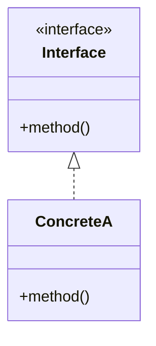

# <% tp.file.title %>

> [!abstract] Pattern Summary
> <% tp.file.cursor(1) %>

---

## 1. Pattern Overview

### Definition


### Problem It Solves

-

### Classification

| Item | Value |
|------|-------|
| Pattern Type | Creational / Structural / Behavioral / Architectural |
| Scope | Class / Object / System / Distributed |
| Complexity | Low / Medium / High |

---

## 2. Structure Diagram

### Mermaid Diagram



### Excalidraw Diagram

<!-- Draw the structure diagram using the Excalidraw plugin, then uncomment below -->
<!-- ![[Assets/Excalidraw/pattern-name-structure.excalidraw]] -->

---

## 3. Implementation Examples

### Basic Implementation

```
// Basic pattern implementation code
```

### Real-World Application

```
// Real-world project application code
```

> [!tip] Key Implementation Points
>

---

<!-- Optional sections: uncomment and fill in as needed -->

<!--
## 4. Application Scenarios

### When to Use
-

### When Not to Use
-
-->

<!--
## 5. Trade-offs

### Advantages
-

### Disadvantages
-
-->

<!--
## 6. Related Patterns

### Frequently Used Together
- [[]] - Relationship description

### Alternative Patterns
- [[]] - Alternative description
-->

---

## Study Checklist

- [ ] Understand pattern definition and purpose
- [ ] Draw the diagram yourself
- [ ] Write basic implementation code
- [ ] Implement at least one real-world application scenario
- [ ] Summarize trade-offs
- [ ] Review after 1 week [scheduled:: <% tp.date.now("YYYY-MM-DD", 7) %>]
